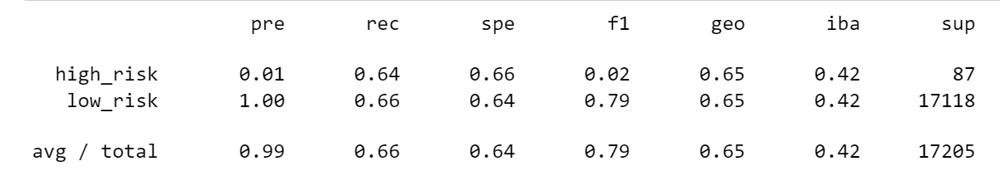
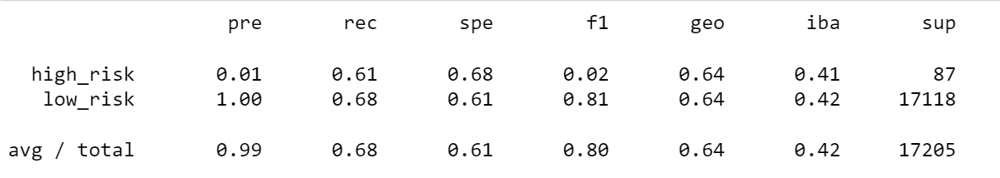
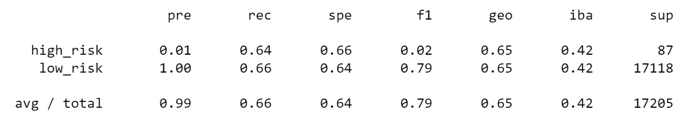
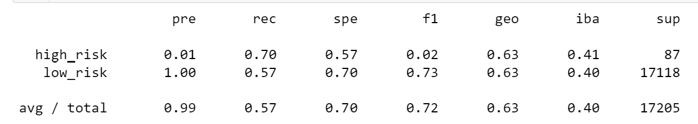
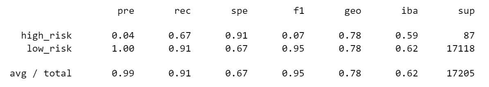
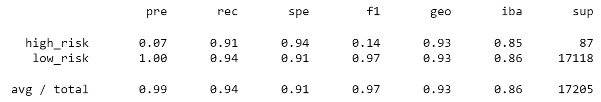

# Credit_Risk_Analysis

## Overview
  These analyses utilize machine learning to assess credit card risk. The following classification reports explain the capabilities of various models in predicting low and high risk loans. 

## Results 

* Undersampling 
  The recall for predicting high and low risk are very close but precision for low risk indicates that there are no false positives.

* Naive Oversampling
  The naive oversampling results are rather similar to those of the undersampling. The precision for low risk is also a noteworthy 1.00. 
  

* SMOTE Oversampling
  The precision is consistent and the recall is still around 0.6.

* Combination (Over and Under) Sampling
The precision continues the same but the recall for high risk loan has jumped a bit and the low risk dropped a little. 

* Balanced Random Forest Classifier 
As a model oriented on eliminating bias, this model shows the first alteration in the the precision for high risk loans, which has increased. The recall for high risk has decreased slightly compared to the combination sampling model, but the low risk loans has risen tremendously. 

* Easy Ensemble AdaBoost Classifier
The easy ensemble model has the highest precision of all models for high risk loans and record recalls for both high and low risk loans.

## Summary 
